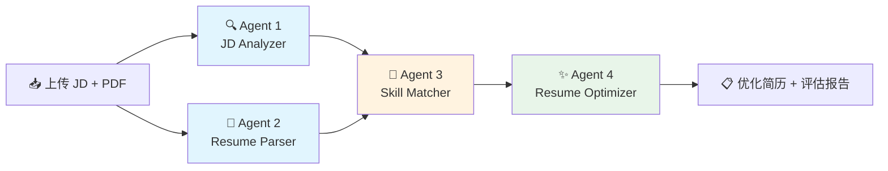
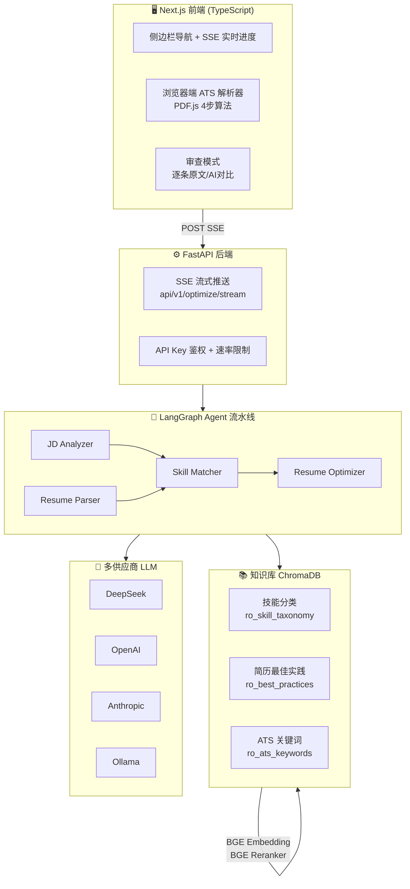

# AI 简历优化 Agent

> AI 驱动的简历优化工具 — 上传 JD 和简历 PDF，4 个 AI Agent 自动分析匹配、生成优化建议、输出 ATS 友好版简历

[](https://www.python.org/)
[](https://fastapi.tiangolo.com/)
[](https://nextjs.org/)
[](https://langchain-ai.github.io/langgraph/)
[](#多供应商支持)
[](LICENSE)

🔗 **GitHub**: [github.com/xuan1205886/resume-agent](https://github.com/xuan1205886/resume-agent)

---

## 目录

- [核心流水线](#核心流水线)
- [技术架构](#技术架构)
- [Agent 详解](#agent-详解)
- [核心设计理念](#核心设计理念)
- [多供应商支持](#多供应商支持)
- [快速开始](#快速开始)
- [前端功能](#前端功能)
- [API 端点](#api-端点)
- [项目结构](#项目结构)
- [评测](#评测)
- [技术栈](#技术栈)
- [License](#license)

---

## 核心流水线



> **阶段 1**：JD Analyzer 与 Resume Parser **并行执行**（无依赖关系）
> **阶段 2**：Skill Matcher 等待两者完成后启动（RAG 检索 + BGE Reranker 精排）
> **阶段 3**：Resume Optimizer 生成最终优化简历（块级提取 → 规则打分 → LLM 排序 → 受限改写 → 事实核查）

## 技术架构



## Agent 详解

| # | Agent | 图标 | Tool | 职责 | 输入 ← | 输出 → |
|---|-------|------|------|------|--------|--------|
| 1 | JD Analyzer | 🔍 | `JDParserTool` | 解析 JD 文本，提取岗位名称、技能列表（含分类/熟练度）、学历经验要求 | `jd_text` | `jd_skills`, `jd_summary`, `jd_position` |
| 2 | Resume Parser | 📄 | `ResumeParserTool` | PyMuPDF 提取 PDF 文本 → LLM 结构化（联系方式/技能/经历/教育） | `resume_pdf_path` | `parsed_resume`, `resume_sections` |
| 3 | Skill Matcher | 🎯 | `SkillMatchTool` | RAG 检索→Reranker 精排→LLM 四级匹配分析（match/partial_match/missing/mismatch） | `jd_skills`, `resume_sections` | `match_results`, `overall_score`, `missing_skills` |
| 4 | Resume Optimizer | ✨ | `BulletScoreTool` + `FactCheckTool` | 提取 bullet→4维打分→LLM 排序→受限改写→事实核查 | 以上全部 | `optimized_resume_md`, `suggestions`, `fact_check` |

## 核心设计理念

### 🛡️ 块级重写 > 全文本重写（防 LLM 幻觉）

```
原文简历 ──→ 提取所有 Bullet Points ──→ 4维规则打分 ──→ LLM排序验证
   (纯代码)         (确定性)        (技能+数字+动词+时效)   (仅排序，不改内容)

     ┌── 分数分布清晰？──→ 跳过 LLM，直接用规则排序（省 30-40% API 调用）
     │
     └── 分数接近？────→ LLM 结合 JD 上下文做语义排序

       ↓
   受限改写（LLM 只改措辞，不编造事实）
       ↓
   事实核查（逐条比对，none/minor/major/fabricated 四级检测）
       ↓
   优化简历
```

### 🔌 可插拔 Agent 架构

新增 Agent 只需 **3 步**（无需改任何现有代码）：

```python
# 1. 写节点函数
def node_new_agent(state): ...

# 2. 注册
AgentRegistry.register(AgentSpec(
    name="new_agent",
    dependencies=["skill_matcher"],  # 声明依赖，Graph 自动推导拓扑
    ...
))

# 3. 重启 → Graph / SSE / 前端全部自动适配
```

### ⚡ 智能跳过优化

不是所有场景都需要 LLM。关键位置的智能判断：

- **Bullet 排序**：规则分数足够分散（spread > 5 且无重复）→ 跳过 LLM 重排
- **事实核查**：通过 `config.yaml` 开关控制（关闭可加速 ~8s）
- **合并调用**：建议生成 + 简历全文改写合并为一次 LLM 调用（节省 5-8s）

### 🔄 真流式推送

`asyncio.to_thread` + `asyncio.Queue` 跨线程通信，前端实时看到每个 Agent 的进度，不是"转圈等结果"。

## 多供应商支持

`config.yaml` 中一行切换，零代码改动：

```yaml
llm:
  provider: deepseek  # deepseek | openai | anthropic | ollama
```

| 供应商 | 配置值 | 模型 | 特点 |
|--------|--------|------|------|
| DeepSeek | `deepseek` | `deepseek-chat` | ⭐ 默认，高性价比，中文能力强 |
| OpenAI | `openai` | `gpt-4o` | 综合能力强 |
| Anthropic | `anthropic` | `claude-sonnet-4-6` | 超长上下文（200K） |
| Ollama | `ollama` | 本地模型 | 完全离线，数据不出机器 |

所有供应商通过 `MultiProviderChatModel` 统一适配（适配器模式），自动处理消息格式转换、System Prompt 提取、指数退避重试。

## 快速开始

### 1. 环境准备

```bash
git clone https://github.com/xuan1205886/resume-agent.git
cd resume-agent

# Python 虚拟环境
python -m venv venv
venv\Scripts\activate   # Windows
source venv/bin/activate  # macOS/Linux

# 安装 Python 依赖
pip install -r requirements.txt

# 配置 API Key
cp .env.example .env
# 编辑 .env，填入 DEEPSEEK_API_KEY=sk-xxx
```

### 2. 构建知识库

```bash
python scripts/build_kb.py
# 如需重建：python scripts/build_kb.py --force
```

### 3. 安装前端依赖

```bash
cd frontend
npm install
```

### 4. 启动服务

```bash
# 终端 1：启动后端 API
python -m uvicorn api_server:app --host 127.0.0.1 --port 8765

# 终端 2：启动前端
cd frontend && npm run dev
```

浏览器打开 **http://localhost:3000**，进入 `/optimize` 页面使用。

### 5. Docker 部署

```bash
docker-compose up -d
# API: http://localhost:8765
# 前端需单独启动：cd frontend && npm run dev
```

## 前端功能

| 页面 | 路由 | 功能描述 |
|------|------|----------|
| 🏠 优化 | `/optimize` | 上传 JD + PDF → 4 Agent 实时进度 → 匹配统计 → 优化建议 → 逐条审查 AI 修改 → 下载 Markdown 简历 |
| 📊 评估 | `/evaluation` | 4 维指标卡片（JD 覆盖率 / 匹配质量 / 事实可信度 / 格式完整度）+ 智能 Badcase 诊断面板 |
| 📋 ATS 解析 | `/ats-parser` | **纯浏览器端** PDF 解析（不上传服务器）→ 模拟 ATS 系统读取 → 7 维评分 + 问题检测 + 结构化结果 |
| 📝 Prompts | `/prompts` | 6 个 Agent System Prompt 展示，支持分类筛选和复制 |
| 📜 历史 | `/history` | SQLite 持久化历史记录，下拉选择查看详情 |

> **ATS 解析器亮点**：200+ 关键词库（学校/学位/职位/公司/技能）、中英文章节检测、浏览器端 4 步算法（提取→分行→分组→评分），参照 OpenResume 设计。

## API 端点

| 方法 | 路径 | 用途 |
|------|------|------|
| `GET` | `/api/v1/health` | 健康检查 |
| `POST` | `/api/v1/optimize/stream` | **主端点** — SSE 流式优化 |
| `POST` | `/api/v1/parse/jd` | 单独解析 JD（调试用） |
| `POST` | `/api/v1/parse/resume` | 单独解析简历 PDF（调试用） |
| `POST` | `/api/v1/match` | 单独技能匹配（调试用） |
| `POST` | `/api/v1/suggest` | 单独生成建议（调试用） |
| `POST` | `/api/v1/write` | 单独生成简历（调试用） |
| `GET` | `/api/v1/history` | 历史记录列表 |
| `GET` | `/api/v1/history/{id}` | 历史记录详情 |

### SSE 事件类型

```
pipeline_start → step_start → step_complete → step_start → step_complete → ...
                                                                              → done
                 step_error（任一 Agent 失败）→ 跳过后续 → done
```

## 项目结构

```
resume-agent/
├── api_server.py              # FastAPI 后端 + SSE 流式端点
├── config.yaml                # 全局 YAML 配置（LLM / Embedding / 检索 / 服务）
├── Dockerfile                 # 多阶段构建
├── docker-compose.yml         # 一键部署
│
├── src/
│   ├── agent/                 # 🧠 LangGraph 多 Agent 系统
│   │   ├── registry.py        #   AgentRegistry 中央注册表（可插拔架构核心）
│   │   ├── graph.py           #   动态 DAG 构建 + 编译（并行/串行双模式）
│   │   ├── nodes.py           #   4 个 Agent 节点函数实现
│   │   ├── state.py           #   AgentState TypedDict（流水线共享状态）
│   │   └── tools.py           #   5 个 LangChain Tool
│   │
│   ├── parsing/               # 📄 解析模块
│   │   ├── jd_parser.py       #   JD 解析（LLM 提取结构化信息）
│   │   └── resume_parser.py   #   简历 PDF 解析（PyMuPDF + LLM 结构化）
│   │
│   ├── matching/              # 🎯 技能匹配
│   │   └── skill_matcher.py   #   RAG 检索 → BGE Reranker 精排 → LLM 分析
│   │
│   ├── optimization/          # ✨ 简历优化核心算法
│   │   ├── bullet_extractor.py    # Bullet 提取（纯代码，确定性）
│   │   ├── bullet_scorer.py       # 4 维规则打分 + LLM 排序验证 + 智能跳过
│   │   ├── resume_writer.py       # 受限改写 + 降级全文本回退
│   │   ├── fact_checker.py        # 4 级事实漂移检测
│   │   └── suggestion_generator.py # 优化建议生成
│   │
│   ├── generation/            # 🤖 LLM 交互层
│   │   ├── llm.py             #   MultiProviderChatModel（多供应商适配器）
│   │   ├── llm_schemas.py     #   Pydantic Schema 定义（输入/输出校验）
│   │   └── output_validator.py #   健壮 JSON 提取 + Schema 校验 + 降级重试
│   │
│   ├── retrieval/             # 🔍 向量检索
│   │   ├── retriever.py       #   ChromaDB 检索器（多 Collection 查询）
│   │   └── reranker.py        #   BGE Reranker（Cross-Encoder 精排）
│   │
│   ├── indexing/              # 🏗️ 索引构建
│   │   ├── embedding_model.py #   SentenceTransformer 全局单例
│   │   └── indexer.py         #   Chroma 索引构建器
│   │
│   ├── api/                   # 🌐 API 层
│   │   ├── auth.py            #   API Key 鉴权 + IP 速率限制
│   │   ├── schemas.py         #   Pydantic 请求/响应模型
│   │   └── session.py         #   内存 TTL 会话管理
│   │
│   ├── evaluation/            # 📊 评估指标
│   │   └── metrics.py         #   4 维评估 + 智能 Badcase 检测
│   │
│   ├── storage/               # 💾 持久化
│   │   └── history.py         #   SQLite (WAL) 历史记录
│   │
│   └── prompts/               # 📝 Prompt 管理
│       └── registry.py        #   Prompt 注册表（版本 + changelog）
│
├── frontend/                  # 🖥️ Next.js 16 前端
│   ├── app/                   #   页面路由（App Router）
│   │   ├── optimize/          #     主优化页（SSE 流式进度 + 审查模式）
│   │   ├── evaluation/        #     评估页（指标卡片 + 诊断面板）
│   │   ├── ats-parser/        #     ATS 解析页（浏览器端 PDF 评分）
│   │   ├── prompts/           #     Prompt 管理页
│   │   └── history/           #     历史记录页
│   ├── components/            #   React 组件
│   │   ├── optimize/          #     优化流程组件（输入/上传/进度/结果/审查）
│   │   ├── evaluation/        #     评估组件（指标卡片/诊断面板）
│   │   ├── ats-parser/        #     ATS 解析组件（评分卡/问题列表/解析结果）
│   │   ├── layout/            #     布局组件（AppShell 侧边栏 + Providers）
│   │   └── ui/                #     shadcn/ui 基础组件
│   ├── lib/                   #   工具库
│   │   ├── ats-parser/        #     浏览器端 ATS 解析引擎（4 步算法）
│   │   ├── api.ts             #     API 客户端
│   │   ├── sse.ts             #     POST SSE 解析器（fetch ReadableStream）
│   │   └── types.ts           #     TypeScript 类型定义
│   ├── hooks/                 #   自定义 Hooks
│   │   ├── useOptimizePipeline.ts  # SSE 事件 → Zustand Store
│   │   ├── useEvaluation.ts        # 评估指标计算
│   │   └── useHistory.ts           # TanStack Query 历史记录
│   └── stores/               #   状态管理
│       └── pipelineStore.ts  #     Zustand 流水线状态
│
├── scripts/                   # 🛠️ 工具脚本
│   ├── build_kb.py            #   知识库构建
│   ├── evaluate.py            #   批量评测
│   └── seed_kb_data.py        #   知识库种子数据扩充
│
├── data/                      # 📦 数据
│   └── kb/                    #   知识库种子 JSON（技能分类/ATS关键词/最佳实践）
│
├── tests/                     # 🧪 测试
│   ├── conftest.py            #   Pytest fixtures + Mock LLM
│   ├── unit/                  #   单元测试（18+ 用例）
│   └── integration/           #   集成测试
│
└── chroma_db/                 # Chroma 持久化目录（运行时生成）
```

## 评测

```bash
python scripts/evaluate.py          # 快速评测
python scripts/evaluate.py --full   # 完整评测（含详细 Badcase 分析）
```

评测指标：

| 指标 | 含义 | 计算方式 |
|------|------|----------|
| `jd_coverage` | JD 技能覆盖率 | (match + partial_match × 0.5) / total |
| `match_quality` | 匹配质量 | 有详细证据（>20字符）的匹配比例 |
| `fact_trust` | 事实可信度 | 事实核查通过率 |
| `format_score` | 格式完整度 | 标准章节（联系方式/技能/经历/教育）覆盖率 |

## 技术栈

| 层 | 技术 | 版本 | 说明 |
|---|------|------|------|
| 前端框架 | Next.js | 16.2 | App Router + Server Components |
| UI 库 | React + shadcn/ui | 19.2 / 4 | Tailwind CSS 4 + 可定制组件 |
| 状态管理 | Zustand + TanStack Query | 5 | 客户端状态 + 服务端缓存 |
| PDF 解析（前端） | PDF.js | 6.1 | 浏览器端 4 步 ATS 解析算法 |
| 后端框架 | FastAPI + Uvicorn | 0.115 / 0.34 | ASGI + SSE 原生支持 |
| Agent 编排 | LangGraph | 0.2 | StateGraph DAG + stream 模式 |
| LLM 抽象 | LangChain Core | 0.3 | BaseChatModel + Tool 接口 |
| LLM 供应商 | DeepSeek / OpenAI / Anthropic / Ollama | — | 自研 MultiProviderChatModel 适配 |
| 向量数据库 | ChromaDB | 0.5 | PersistentClient + 余弦距离 |
| Embedding | SentenceTransformers | 3.0 | paraphrase-multilingual-MiniLM-L12-v2 |
| Reranker | BGE Reranker | — | BAAI/bge-reranker-base Cross-Encoder |
| PDF 解析（后端） | PyMuPDF | 1.24 | C 扩展实现，高性能 |
| 配置校验 | Pydantic + PyYAML | 2.10 / 6.0 | 双层加载（YAML + .env） |
| 存储 | SQLite (WAL) | — | 历史记录持久化 |
| 测试 | Pytest + pytest-asyncio | 8.0 | 18+ 单元测试 + Mock LLM |
| 部署 | Docker + Compose | — | 多阶段构建 + 非 root 用户 |

## License

MIT © [zhouxuan](https://github.com/xuan1205886)
